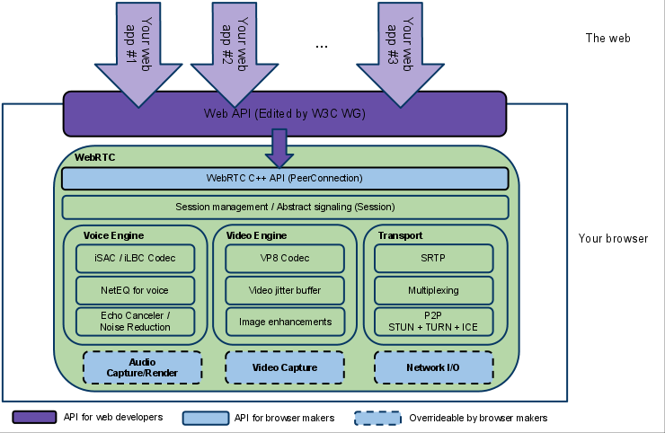

# 1. Introduction
在这，我会记录下我学习WebRTC时看到的觉得还不错的一些资料，让跟我一样在学WebRTC的人少走弯路。

# 2. Architecture
  

## 2.1 Core components

### 2.1.1 Transport/Session

#### 2.1.1.1 Video Jitter Buffer
 * [视频流抖动计算](https://www.cnblogs.com/ishen/p/15000909.html)
 * [从贝叶斯到卡尔曼滤波](https://www.cnblogs.com/ishen/p/14987878.html)

### 2.1.2 NAT/STUN/TURN/ICE
 * [ICE-STUN-TURN brief introduce](https://webrtc.mthli.com/basic/ice-stun-turn/)
 * [What is the STUN Protocol? - STUN](https://www.3cx.com/blog/voip-howto/stun/)
 * [STUN - RFC5389](https://www.rfc-editor.org/rfc/rfc5389)
 * [STUN - RFC3489](https://www.rfc-editor.org/rfc/rfc3489)
 * [TRUN - RFC5766](https://www.rfc-editor.org/rfc/rfc5766)

### 2.1.3 VoiceEngine
#### 2.1.3.1 Audio Codec
 * [音频编码原理 - Audio/Speech coding principle](https://github.com/gnolizuh/webrtc-tutorial/blob/main/%E9%9F%B3%E9%A2%91%E7%BC%96%E7%A0%81%E5%8E%9F%E7%90%86%E5%85%A5%E9%97%A8.pdf)
 * [心理声学模型 - Psycho acoustic model](https://blog.csdn.net/Jianing_Wang/article/details/105779558)
 * [采样定理 - Nyquist-Shannon sampling theorem](https://www.zhihu.com/question/24490634)
 * [音频编码分帧 - Audio framing](https://www.zhihu.com/question/52093104)
 * [线性预测编码 - Linear Predictive Coding](https://ccrma.stanford.edu/~hskim08/lpc/)
 * [噪声整形 - Noise Shaping](https://www.sageaudio.com/blog/mastering/what-is-noise-shaping.php)
 * [傅立叶变换 - Fourier transform](https://charlesliuyx.github.io/2018/02/18/%E3%80%90%E7%9B%B4%E8%A7%82%E8%AF%A6%E8%A7%A3%E3%80%91%E8%AE%A9%E4%BD%A0%E6%B0%B8%E8%BF%9C%E5%BF%98%E4%B8%8D%E4%BA%86%E7%9A%84%E5%82%85%E9%87%8C%E5%8F%B6%E5%8F%98%E6%8D%A2%E8%A7%A3%E6%9E%90/)
 * [滤波器组 - Filter bank](https://www.electrical4u.com/filter-bank/)
 * [变时不变调 - Time-Scale Modification of Music Signals/WSOLA](https://mdpi-res.com/d_attachment/applsci/applsci-06-00057/article_deploy/applsci-06-00057-v2.pdf?version=1458229514)

#### 2.1.3.2 NetEQ
 * [WebRTC语音引擎中NetEQ技术的研究](https://github.com/mobinsheng/books/blob/master/WebRTC%E8%AF%AD%E9%9F%B3%E5%BC%95%E6%93%8E%E4%B8%ADNetEQ%E6%8A%80%E6%9C%AF%E7%9A%84%E7%A0%94%E7%A9%B6_%E5%90%B4%E6%B1%9F%E9%94%90.pdf)

#### 2.1.3.3 Automatic Gain Control (AGC)
 * [AGC原理解析](https://juejin.cn/post/7121554621700505636)
 * [Software Implementation of Automatic Gain Controller for Speech Signal](https://www.ti.com/lit/wp/spraal1/spraal1.pdf?ts=1668410969756&ref_url=https%253A%252F%252Fwww.google.com%252F)

#### 2.1.3.4 Acoustic Echo Canceler (AEC)
 * [Research on Adaptive Acoustic Echo Cancellation Algorithm in Digital Hearing Aids](https://aip.scitation.org/doi/pdf/10.1063/1.4992990)

#### 2.1.3.5 Noise Reduction (NR)

### 2.1.4 VideoEngine

### 2.1.5 QoS

#### 2.1.5.1 Google Congestion Control
 * [GCC for WebRTC](https://c3lab.poliba.it/images/6/65/Gcc-analysis.pdf)
 * [draft-alvestrand-rtcweb-congestion-01](https://www.ietf.org/archive/id/draft-alvestrand-rtcweb-congestion-01.html)
 * [draft-ietf-rmcat-gcc-02](https://datatracker.ietf.org/doc/html/draft-ietf-rmcat-gcc-02)